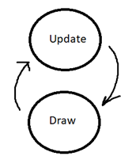

# Navigation Structure
{: .no_toc }

## Table of contents
{: .no_toc .text-delta }

1. TOC
{:toc}

---

# Game Loop

## What is a game loop?

A game loop is the overall flow control for a game. Generally, it's an infinite loop that exists while the game application is
running, and will continually do the same actions over and over again. Each game loop iteration is known as a frame. The number
of game loop iterations that are completed per second is how frames per second (FPS) is calculated.

## How does this engine's game loop work?

The game loop is created using the `Timer` class from Java Swing. The timer is set up to continually "tick" after a predefined number
of milliseconds have elapsed. While it's not perfect, it does the job well and for the most part maintains its tick cycle to match
the desired FPS. To adjust the FPS of the game, the `Config` class has a variable named `FPS` which can be changed as desired. It currently
is set to 100 as I found that the timer lags a bit when set to a standard 60 FPS, but YMMV based on the computer being used.

Each "tick" of the game loop (each time the loop iterates), it does two things: updates game logic and then updates the graphics
that are rendered to the screen based on the updated game logic. That's it. Here is a very detailed diagram illustrating the game loop:

All jokes aside, at the end of the day that is all the game loop is doing -- continually cycling between `update` and `draw` calls.

Something important to note is that the `draw` section of the game loop should ONLY contain code to draw graphics to the screen and should NOT
include any kind of game logic, such as moving graphics to a new location. Any game logic should only take place in the `update` section of the game loop.
This is because of the way the Java JPanel's graphics painting is set up. While the game can call to the JPanel (which this game engine uses as a buffer to display graphics)
and tell it to update its graphics (also known as a "repaint"), this merely "schedules" the repaint instead of carrying it out right away. The JPanel
can then carry out the repainting whenever it damn well pleases outside of your program's control, and there's a possibilty that it doesn't carry out the repainting at all.
When draw calls are skipped like this, it is known as lag, because the game is updating its game logic but not representing those logic changes
with updated graphics on the screen. Lag is unavoidable at the end of the day, but it's imperative to not place game logic updating in the `draw` section of the game loop
because having logic "skipped" or ran "out of order" will completely break the game, while the concept of "lag" will at least maintain game logic integrity
to keep the game working.

## What is considered game logic?

Game logic is any code that has to do with the game being carried out, which includes anything from detecting key presses, moving something to a new location,
collision detection, etc. All game logic belongs in the `update` section of the game loop. Each iteration of the game loop will
force the game to re-run its game logic, which is essential to making the game run continually. If you write game logic that
moves a player one pixel to the right when the right arrow key is held down, the `update` cycle will continually check for the
right arrow key being pressed and if so move the player to the right one pixel each time. Without the game loop, there'd be no way
to apply this logic continually.

Anytime in the codebase you see an `update` method, and you will see it in nearly every class, it is where game logic is being run
by the game loop when an instance of that class is active.

