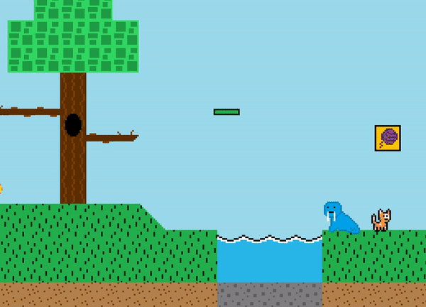

# Navigation Structure
{: .no_toc }

## Table of contents
{: .no_toc .text-delta }

1. TOC
{:toc}

---

# Player Win or Lose Level Logic

The `Player` class has a `levelState` variable which it uses to determine if it is currently playing the level, completed the level,
or lost the level (died). Upon the `levelState` being set to either the `LEVEL_COMPLETED` or `PLAYER_DEAD` state,
different `update` logic will be run instead of the usual player traversing through the level.

## Player Win Logic -- Level Completed

When the player touches a `LevelEndBox` enhanced map tile, it will result in the player's `levelState` being set to `LEVEL_COMPLETED`.
When this happens, the `update` logic changes to use the `updateLevelCompleted` method. This method is what performs the "animation" where after the player hits
the `LevelEndBox`, it will fall to the ground, and then walk to the right until it goes off screen. Once it goes off screen, it will signify
to the `PlayLevelScreen` that the level has been won.

## Player Lose Logic -- Player Died
 
When the player dies from touching an enemy, it will result in the player's `levelState` being set to `PLAYER_DEAD`. When this hapens,
the `update` logic changes to use the `updatePlayerDead` method. This method is what performs the death animation where the player falls down until they go
off screen, at which point the `PlayLevelScreen` is notified that the player has died.

