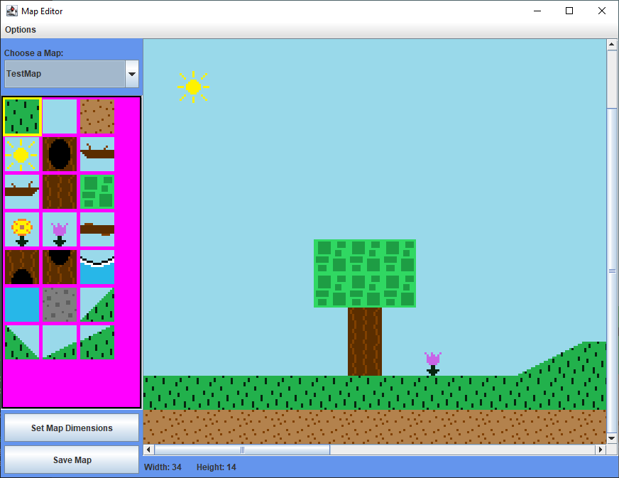
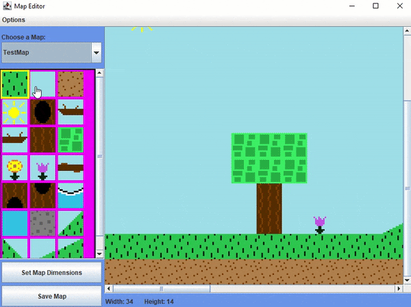

## Table of contents
{: .no_toc .text-delta }

1. TOC
{:toc}

---

# Map Editor

## What is a map editor?

In this project, there is another application separate from the game itself called the Map Editor (all located in the `MapEditor` package) that will load up a GUI for designing game [tile maps](/GameCodeDetails/Map/MapTilesAndTilesets).
The map editor provides a nice interactive display to work with when creating maps instead of having to do so purely through code.
Nearly every video game uses a map editor (level editor, level maker, etc.) that game developers use to design the game's maps. 

## This game's map editor

The inspiration behind the design of the map editor for this game engine came from the old CD-ROM game [Speedy Eggbert](https://en.wikipedia.org/wiki/Speedy_Eggbert), which was a staple of my childhood. 
It was a standard platformer game (with some VERY odd design choices), but the level editor included with it was the same one used by the game developers to actually make the game -- it was so fun as a child to be able to create my own levels for a game I really liked. 
If you're curious, [here](https://www.youtube.com/watch?v=haRt2Z8-7-A) is a video of the Speedy Eggbert map editor being used.

While this game's map editor is limited compared to commercial map editors for other video games you may have seen/used, it is still very useful for designing a map and being able to see what you are doing as you go. 
It is currently only usable for placing map tiles -- other entities like NPCs must be created and added through code.

To start the map editor, run the `main` method in the `MapEditor` class. 
Remember that this is a separate program from the actual game code, although both make use of the same classes in this project.
You can have both the map editor and the game running at the same time.

## Map Editor features

This Map Editor allows you to do the following:

- Add a new Map to the game
- Change the individual tiles of a map (which maintain their tile logic defined in code)
- Change the dimensions of a map (how many tiles the map contains width and height wise)



## How to use the map editor

It should be pretty self-explanatory how to use the map editor after playing around with it for a few minutes. 

The left-hand sidebar contain the tiles that can be used for the map. 
Each `Map` subclass (such as `TestMap`) defines its own `Tileset` (such as `CommonTileset`) which is where these tile options come from.
You can read more about the `Map` class [here](/GameDetails/Map) and about map tiles and tilesets [here](/GameDetails/Map/MapTilesAndTilesets). 

Any tile on the left-hand sidebar can be clicked to "select" it. 
The tile is highlighted with a yellow box. 
Afterwards, going to the map and clicking will replace whichever tile was hovered by the mouse with the selected tile. 

Below is a gif showing this process.



The dropdown on the top left can be used to change which map is currently being edited. 
To save any changes to a map, hit the "Save Map" button. 
Do not forget to do save the map before switching maps or existing the program!
Otherwise, any changes to be discarded.

The "Set Map Dimensions" button will allow you to change the size of the map (number of tiles width and height). 
It'll also allow you to choose which side of the map to apply changes to when growing/shrinking a map's dimensions -- for example, if increasing the width of the map, more tile space can be added either to the right side or the left of the map.

Something to keep in mind is after a map has been created using that `Tileset`, you should not rearrange the order the tiles are defined and added to the list in a `Tileset's` `defineTiles` method. 
Doing so will break existing maps. 
You should ALWAYS just append tiles on to the end of the `defineTiles` method, even though it may feel disorganized, in order to preserve the tile map's integrity.

## Adding a new map to the map editor

Adding a new map to the map editor (and essentially creating a new map entirely) is a relatively easy process.

First start by creating a new class in the `Maps` package that extends the `Map` class. You can look at `TestMap` as a reference for how to do this.
Then for now, all that's needed is a constructor to define the map file name, tileset, and player starting position. An example is below:

```java
public class MyMap extends Map {
    public MyMap() {
        super("my_map.txt", new CommonTileset());
        this.playerStartPosition = new Point(1, 11);
    }
}
```

In the above example, the map's file will be named "my_map.txt", and the `CommonTileset` class will be used as the map's tileset.
The map file "my_map.txt" has not been created yet, but the Map Editor will do so for you momentarily. 
Make sure that two maps do not share the same map file name, or one will overwrite the other!

Now, in the `MapEditor` package, go to the `EditorMaps.java` file. In here, you will need to add your new map to some of the class's methods.

In the `getMapNames` method, add an entry to the list for the name you would want the map to be recognized by -- for this example, I will be using "MyMap".


```java
public static ArrayList<String> getMapNames() {
    return new ArrayList<String>() {{
        add("TestMap");
        add("TitleScreen");
        add("MyMap");
    }};
}
```


Then, in the `getMapByName` method, add another switch case for your new map name and return an instance of your new Map class.
For this example, I am adding a switch case for "MyMap" and it is returning `new MyMap()`:

```java
public static Map getMapByName(String mapName) {
    switch(mapName) {
        case "TestMap":
            return new TestMap();
        case "TitleScreen":
            return new TitleScreenMap();
        case "MyMap":
            return new MyMap();
        default:
            throw new RuntimeException("Unrecognized map name");
    }
}
```

The last thing you have to do is open the Map Editor and in the drop down select your new map. 
The Map Editor will create a new blank map file for it upon saving the map. 
Next, you have to change the map dimensions to the desired width and height.
Finally...you can now start designing the map!

Map files can be found in the project's `MapFiles` folder. 

## Options Menu

At the top left of the Map Editor window, there is a menu strip with an "Options" menu item. 
Clicking it will reveal three options - "Show NPCs", "Show Enhanced Map Tiles", and "Show Triggers". 
Toggling an option on will show the desired entities in the map editor. 
The entities cannot be moved or interacted with in the editor, but it does at least show you where these entities are placed on the map.

Since triggers are invisible and can't normally be seen on the map, the map editor will draw them as magenta boxes with a black border to help with visualizing and positioning them.
They will not appear like this in the actual game.

## How does the map editor work?

I used Java Swing components for the GUI and control functionality (such as buttons, drop down menus, etc.).

I will say that this was NOT easy to code up and get working. 
It's also a bit fragile as all map editors are, since it has major dependencies on game logic classes that it has no control over such as the `Map`, `MapTile`, and `Tileset` classes,
and if any of those classes change, it can easily break the map editor. 
Such is life.

Below is some generic guidance if you are looking to develop the Map Editor further.
I only recommend working on this if you are experienced working with Java Swing components.

The `EditorWindow` contains a JFrame. It sets the `EditorMainPanel` as its content pane.

The `EditorMainPanel` is a JPanel that holds two other JPanel components:
- `EditorControlPanel`: map name selection drop down menu and save map button are there, etc.
- `MapBuilder`: the right side where the map is displayed and tiles can be added and edited.

The `EditorControlPanel` utilizes the `TilePicker`, which is ANOTHER JPanel that displays the tile graphics that can be selected on the left side panel, and is where that tile selection logic takes place. 
The `SelectedTileIndexHolder` class is used to store the currently selected tile, which is passed around to allow other classes to access that data.

The `MapBuilder` JPanel defines the scroll pane and map info labels (like "width" and "height" at the bottom of the map display).
Inside the scroll pane, it places the `TileBuilder` JPanel, which is where tiles can be replaced by the selected tile from the `TilePicker` based on the value in `SelectedTileIndexHolder`.

Both `TilePicker` and `TileBuilder` have listeners for mouse click and hover inputs.

The `ChangeMapSizeWindow` class is specifically for the window that pops up after clicking the "Change Map Size" button in the `EditorControlPanel`.
 his class lets you change the size of the map.

The "Save Map" button will overwrite a map's assigned map file with what it looks like in the editor.

I apologize deeply that there are little to no comments for the map editor classes, I will go back sometime and fix that. Maybe. I'm not going to do it.
